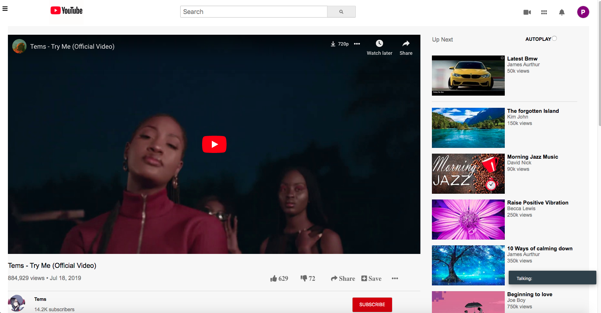

# Youtube-clone

> Youtube video page clone.

Additional description about the project and its features.

## Built With

- HTML,
- CSS,

## Live Demo

[Live Demo Link](https://vigorous-knuth-6c8127.netlify.com)

## Getting Started

**This is an example of how you may give instructions on setting up your project locally.**
**Modify this file to match your project, remove sections that don't apply. For example: delete the testing section if the currect project doesn't require testing.**

To get a local copy up and running follow these simple example steps.

### clone the app

### open the index.html file in your browser

## Authors

👤 **Patrick Nyatindo**

- Github: [@githubhandle](https://github.com/nyatindopatrick)
- Twitter: [@twitterhandle](https://twitter.com/nyatindopatrick)
- Linkedin: [linkedin](https://linkedin.com/in/nyatindopatrick)

👤 **Adewale Modupe**

- Github: [@githubhandle](https://github.com/Eshy10)
- Twitter: [@twitterhandle](https://twitter.com/AdesholaAdewal6?s=09)
- Linkedin: [linkedin](https://www.linkedin.com/in/adewale-adeshola-b0b581139)

## 🤝 Contributing

Contributions, issues and feature requests are welcome!

Feel free to check the [issues page](issues/).

## Show your support

Give a ⭐️ if you like this project!

## Acknowledgments

- Hat tip to anyone whose code was used
- Inspiration
- etc

## 📝 License

This project is [MIT](lic.url) licensed.
